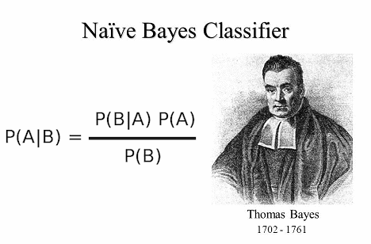
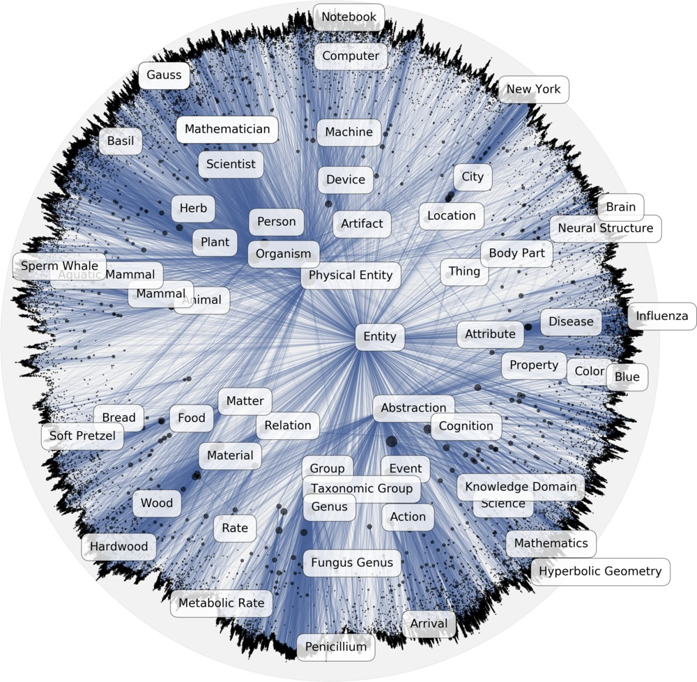
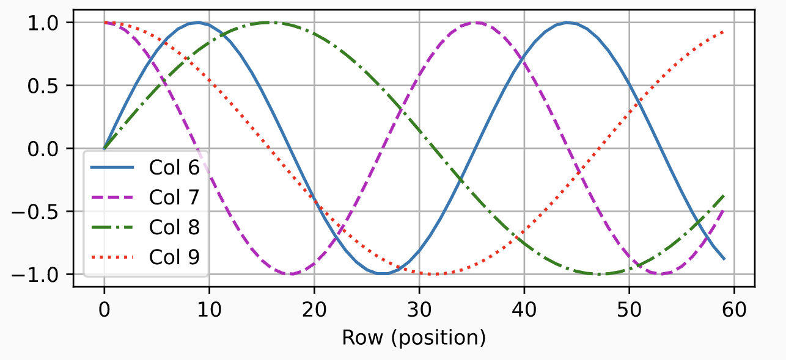
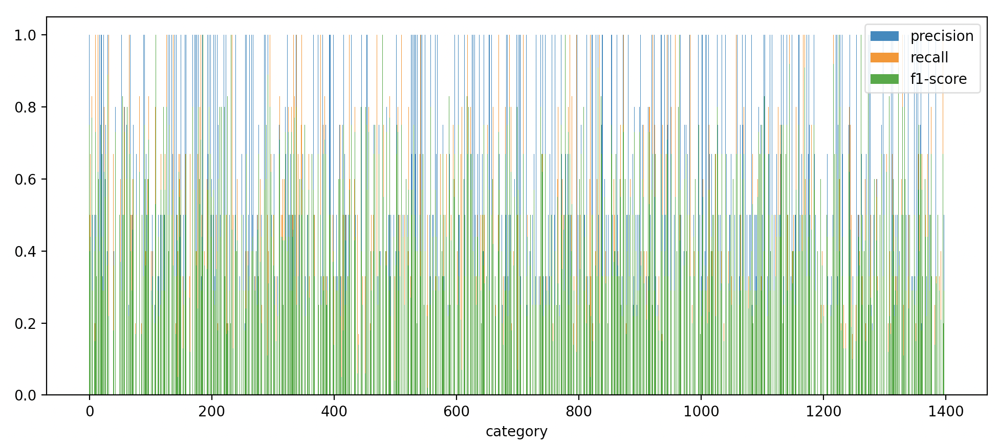

# Adthena Technical Interview: Metalabel Classifier

## Task
Classify search terms accurately 
by assigning a category
(or categories for multilabel classification)
to each search term (e.g. "cricket nets")

e.g.

```python
from src.models.classifier import TopicClassifier

model = TopicClassifier()

model.classify(search_term="cricket nets")
>>> ["Sports & Fitness", "Sporting Goods", "Cricket Equipment"]
```

---
## SOLUTION
We shall present 2 different approaches to solve this task and compare their pros and cons

---
## [1] Zero-Shot Classification

The first approach utilises zero-shot classification via a large language model (e.g. ChatGPT, GPT3, etc). This is simple to setup in a few lines of code using my pip-installable package ["prompt-engineering"](https://pypi.org/project/prompt-engineering/): 

e.g.
```
pip install prompt_engineering
```
```python
from prompt_engineering import api, task

@api(
    endpoint="https://api.openai.com/v1/engines/text-davinci-002/completions",
    key=YOUR_OPENAI_KEY,
    hyperparameters=dict(temperature=0.6),
    cache=False,
)
def gpt3(data: dict) -> None:
    return data["choices"][0]["text"]

@task("topic_classification")
def zero_shot_classify(search_term: str) -> str:
    generated_text = gpt3(dict(prompt=search_term))
    return generated_text.split("The topic of this article is:")[-1].strip()
```

The code can be found in `zero_shot_test.py` and run if desired (note: requires you to insert a valid api key first):

e.g.
```
python zero_shot_playground.py
```

Alternatively, you can view the precomputed results stored in `data/zeroShotPredictions.csv`. 

**Pros**

The advantages of this approach are:
-  it requires no training (which is why there is no associated training file) and so it can be used straightaway with minimal setup (i.e. few lines of code). 
- The predicted categories (classes) do not need to be predefined (as they are generated at the discretion of the model itself).  
- The predictions are quite good for the large part (below are some example results taken from the above-mentioned file)


| search term | (zero-shot) class |
| --- | --- |
| australian embassy visa contact number | Travel |
| best bond funds | Investment |
| stanley glue sticks | Products |
| kraft thousand island dressing | Food |
| buffalo mountain shirt | Shopping |
| black shearling jacket | Fashion |
| du lac et du parc grand resort | Travel |

 
**Cons**

Since the model is the generates the class labels (at its own discretion), there is also no way to bound it or strictly control it which mean we cannot guarantee superficial variations of the same class won't appear (e.g. camera vs cameras vs camera equipment, etc). Furthermore, the model can fail to successfully predict a category, as with the examples below (the second, third and fourth examples highlight another problem wherein the model returns a very specific category label which will not likely generalise to cover multiple search terms, thus defeating the purpose of the task)

|search term | (zero-shot) class |
| --- | --- | 
| grey mail | N/A | 
| clarks wellies | Clarks Wellies |
| stainless steel bbq grill | Stainless steel BBQ grills |
| each designed for a specific fridge deodoriser | How to remove fridge odor |

In other cases, the model did not properly predict a label (as specified by the prompt) and instead went on to answer the search query instead (see some examples below)

|search term | (zero-shot) class |
| --- | --- |
| writing prompts for kids | 1. If you could have any superpower, what would it be? |
| types fire extinguisher | There are many different types of fire extinguishers | 

In summary, there are various problems and edge cases which arise when using such an approach. Some of these may be mitigated by:
- using a better model (e.g. ChatGPT, GPT4, etc) 
- or using filters (e.g. only accept predictions which are title case, and have less than 3 words, etc), 
- or fine-tuning the prompt, 
- decreasing the temperature of the model, 
- increasing the number of predictions returned by the model (and ranking them), etc.  

However, the risk of such results will always inherently exist.  Another weakness of this approach is related to the cost of using a 3rd party API (as the model itself is quite large to host). This could be circumnavigated, however, by using the model it to creating a labelled dataset and then training a smaller language model (e.g. GPT-j) which could then be run locally or served relatively cheaply.

--- 
## [2] Gaussian Naive Bayes with Positional Poincare Representations

When dealing with a classification task with a large number of classes (i.e. > 1000), it is quite likely a powerful model is required (i.e. transformer-based, language models, etc).  However, large neural models (i.e. > billion parameters) require a certain amount of RAM to run, which exclude certain services (like AWS lambda) which can help save costs (as it only runs instances of the model when needed). Supposing we use an AWS sagemaker instance with 32GB RAM (without GPU) instead, then that can end up costing nearly $1 an hour - which can end up being more expensive than calling a 3rd party API in the first place! 

Instead, our second approach trains a very simple, lightweight ML algorithm called the (Gaussian) Naive Bayes 

**Pros**

The advantages of this approach include:
- It is a far smaller model and requires minimal space to host and serve.
- It is fast to compute
- It is extremely quick to train 
- If nothing else, it makes a good baseline to compare more sophisticated ML models against (but often performs very well itself)

**Cons**

Naive Bayes relies on a false underlying assumption (which makes it naive) - namely that each input feature is independent. Furthermore, unlike language models or deep neural networks which embed the input as well as classifying, Naive Bayes requires the inputs (i.e. search terms) to be embedded before being passed to it. 

**Preprocessing**

The powerful [poincare embeddings](https://arxiv.org/pdf/1705.08039.pdf) are used (which encodes word relations more naturally in a specific kind of non-euclidean space)  in combination with positional embeddings inspired by transformer models (to ensure the relative position of words are also taken into account in the final sentence embedding) .  Fortunately, my pip-installable package [ffast](https://pypi.org/project/ffast/) takes care of all the preprocessing and embedding in a few lines of code. 

```python
from ffast import tokeniser
tokeniser = load("poincare")
tokeniser.encode("some text").vector
```
This can be found in the file `src/encoding/search_term.py` (but, if interested in the specifics of what happens behind-the-scenes, the exact line of code where the positional poincare embedding occurs is [here](https://github.com/mohammedterryjack/ffast/blob/3f0689226c48ed64298d1e3deb9b09bb2f137417/ffast/poincare/tokens.py#L66))

---

## Testing 

Run `test.py` to test the trained model.  Use `--data` to specify the test data to use

e.g.
```
python test.py --data path/to/testData.csv 
```

If left unspecified, the testset `data/candidateTestSet.txt` will be loaded in by default (downloaded from [here](https://s3-eu-west-1.amazonaws.com/adthena-ds-test/candidateTestSet.txt)).  

The classification results are stored in `data/predictions.csv` by default (the location and filename can be specified via `--results`)

```
python test.py --results path/to/results.csv 
```

The data will be returned in the format of the training set (downloaded from [here](https://s3-eu-west-1.amazonaws.com/adthena-ds-test/trainSet.csv)), which uses ids for the categories. 

---

## Training
If you wish to retrain the model, simply run `train.py`.  To specify which dataset to use, specify via the flag `--data` (if left unspecified, the file `src/data/trainSet.csv` will be used by default). 


```
python train.py --data path/to/trainData.csv
```

---

## Evaluation

**Qualitative**

A manual inspection of the first ten predicted results (compared against the expected categories) can give a qualitative idea of the model's predictions and the types of mistakes it makes.  `test.py --data data/manual_inspection.txt` was run and some of the search terms the model correctly predicted include:

|Search Term | Class |
| --- | --- |
|extra watermelon gum | 1108|
|rose gold pearl necklace|821|
|buy arsenal tickets|958|
|gold pom poms|562|
|tyr fusion|158|

Some of the search terms the model incorrectly predicted include: 

|Search Term | (Expected) Class | (Predicted) Class | Search Terms Related to Predicted Class |
| --- | --- | --- | --- |
|fire detection shop|19|746|fire awareness, argos fire station, fire marshal training london...|
|cheap couch roll|398|658|a1 paper roll, polystyrene coving adhesive, ...|
|next bed frames|225|1209|vintage picture frames, personalised collage photo frames, ...|

Which seem to be misclassified into sensible/plausible categories (i.e. related to at least one word mentioned in the search term)


**Quantitative**

Regarding more quantitative metrics, there are a few to choose from . We can even use confusion matrices to get a good idea of how well the model is predicting each class (and which classes are being confused for others).  We exclude the confusion matrix from this report (as there are a lot of classes and we will suffice with the above forementioned metrics).  We run the above metrics (i.e. precision, recall, etc) on an unseen data set (1% of the original training data which was held out from training) stored in the file `data/report_file.txt` and summarised in the following plot 